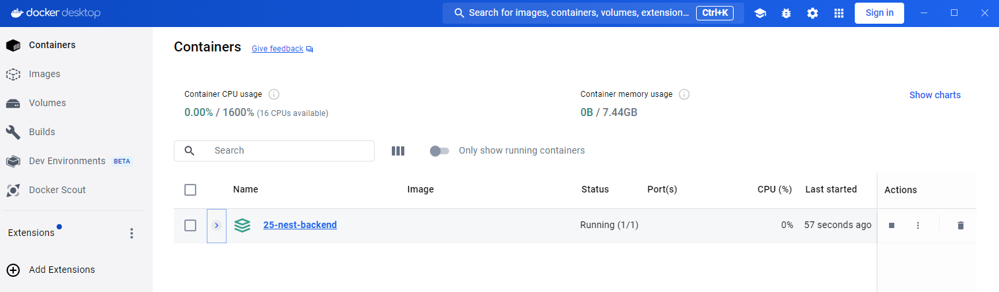
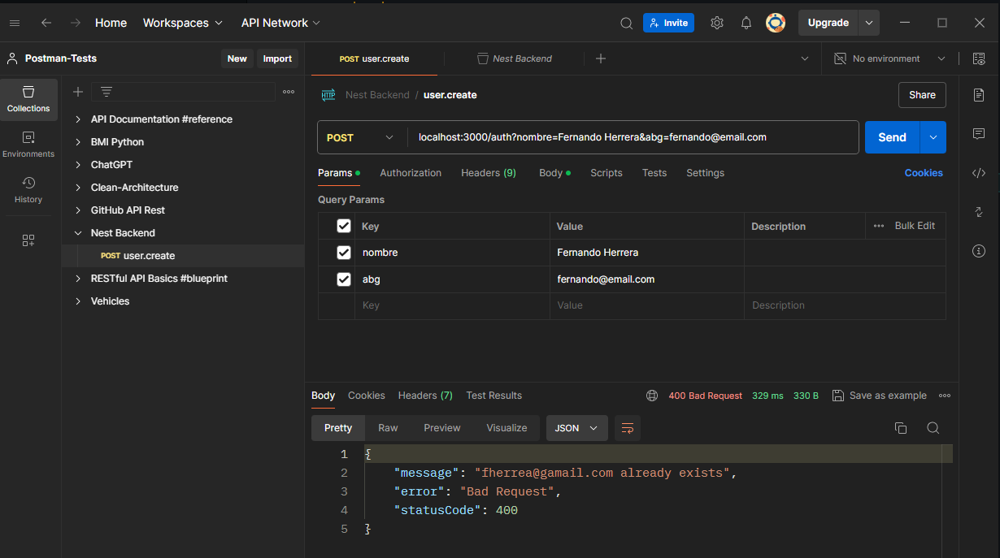

# Backend en NEST

1. Arrancar la aplicacion
```
npm run start:dev
```

2. Ejecutar Docker Desktop


3. Levantar la BBDD

```
docker compose up -d
```


3. Copiar `.env.template` y renombrarlo como `.env`


4. Si conectamos con postman el servicio debe estar listo

